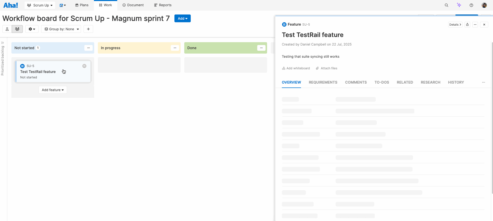
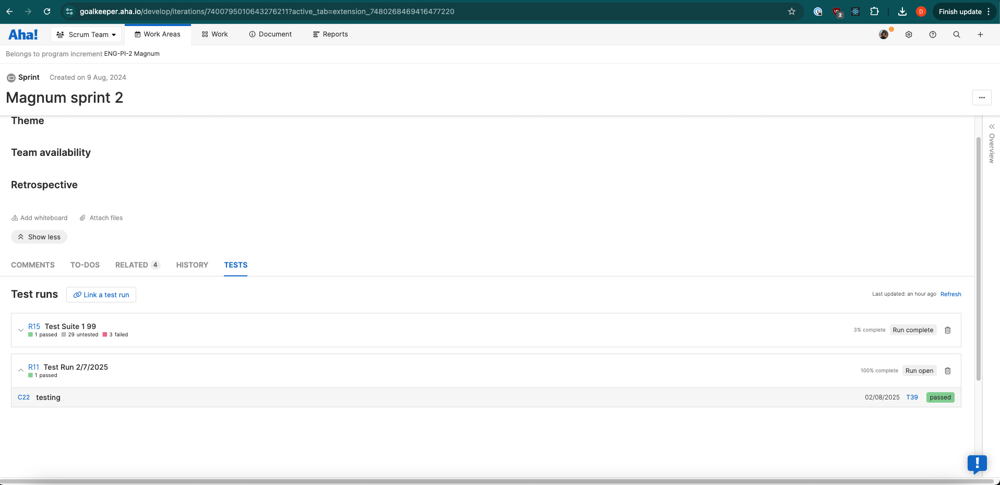
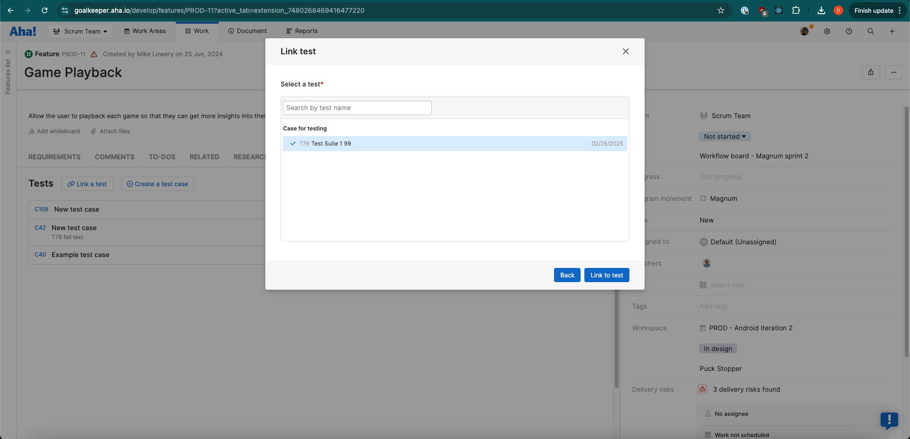
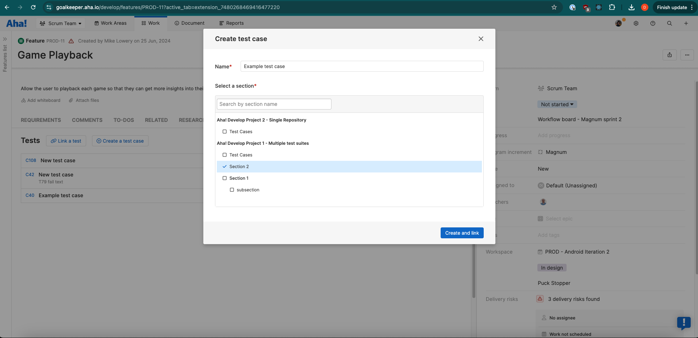
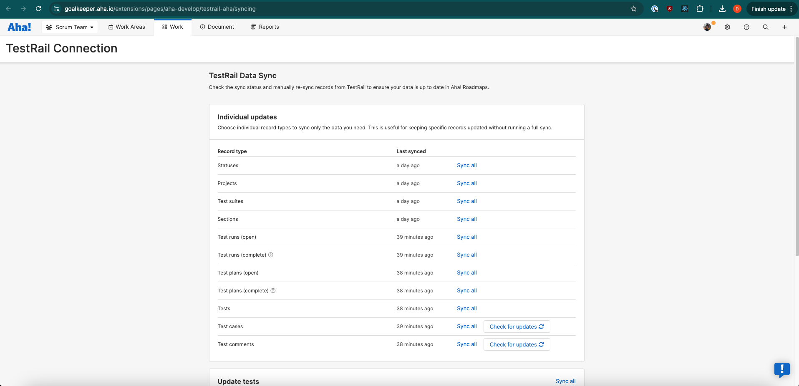
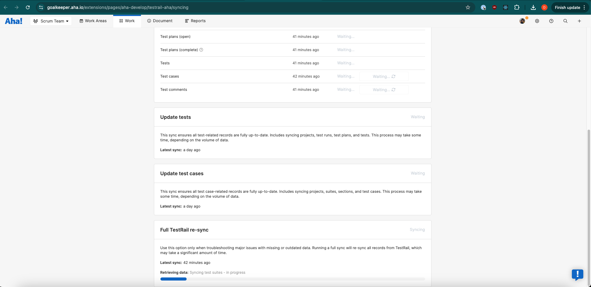

# aha-develop.testrail

This is an extension for [Aha! Develop](https://www.aha.io/develop) providing integration with TestRail.

It provides these contributions:

- `Tests tab (on features/reqs)` - Manages automatic syncing of TestRail data, allows linking of test cases and tests and creation of new test cases.
- `Tests tab (on sprints)` - Manages automatic syncing and allows linking test runs to sprints.
- `TestRail Connection page` - Allows for finer-grained control of TestRail data sync, such as loading new projects and suites. Under the 'Work' menu item.
- `Sync events` - The 10 syncing events are called by the connection page and auto-sync to fetch data from TestRail
- `Create Test Case event` - Calls the TestRail API to create new test cases

## Demo



## Screenshots







## Installing the extension

**Note: In order to install an extension into your Aha! Develop account, you must be an account administrator.**

1. Install the TestRail extension by clicking [here](https://example.com).

2. As a TestRail user with access to all projects you want to sync, configure an API key in TestRail.
   - In TestRail, click on your username and select 'My Settings', then go to the 'API Keys' tab.

   - Choose to add a new key, with a memorable name. After clicking 'Generate key', copy the displayed key.

   - Choose 'Add key', and then click 'Save settings' to persist your changes.

3. Configure the extension with your settings.
   - In Aha! go to Settings -> Account -> Extensions -> TestRail.

   - Copy the key from step 2 into the 'TestRail API token' field, and click 'Update secret' (after save the field will remain blank as a security measure).

   - Enter your TestRail domain (the name before `.testrail.io`) into the 'TestRail Domain' field.

   - Enter the TestRail email address of the user that generated the key in step 2 into the 'TestRail API Username' field.

4. Run initial sync.
   - In Aha!, go to Work -> TestRail Connection. Click 'Sync all' next to 'Full TestRail re-sync'.
   - You can also trigger initial sync by visiting the tests tab on any feature, requirement or sprint.
   - Do not leave or refresh the page while initial sync is running, or it will restart. You can safely work in other tabs while it is running.

## Working on the extension

Install `aha-cli`:

```sh
npm install -g aha-cli
```

Clone the repo:

```sh
git clone https://github.com/aha-develop/testrail-aha.git
```

Install required modules:

```sh
yarn install
```

The extension makes requests to GitHub's graphql API. Changes to the graphql queries in lib/github/queries need to be compiled by running:

```
yarn codegen
```

**Note: In order to install an extension into your Aha! Develop account, you must be an account administrator.**

Install the extension into Aha! and set up a watcher:

```sh
aha extension:install
aha extension:watch
```

Now, any change you make inside your working copy will automatically take effect in your Aha! account.

## Building

When you have finished working on your extension, package it into a `.gz` file so that others can install it:

```sh
aha extension:build
```

After building, you can upload the `.gz` file to a publicly accessible URL, such as a GitHub release, so that others can install it using that URL.

To learn more about developing Aha! Develop extensions, including the API reference, the full documentation is located here: [Aha! Develop Extension API](https://www.aha.io/support/develop/extensions)
